# Azure Firewall Manager

In this scenario, we want to be able to prevent access to web addresses not on the approved list.

# Technologies

* Virtual Networks.
* Virtual Network Peering.
* Virtual Machines.
* Azure Firewall Manager.
* Firewall Policies (DNAT, Application, Network).
* Route Tables.

# Resource group creation

First, we need to create two spoke virtual networks and subnets.

* Go to portal.azure.com.
* Search for virtual Networks.
* Click on Create.

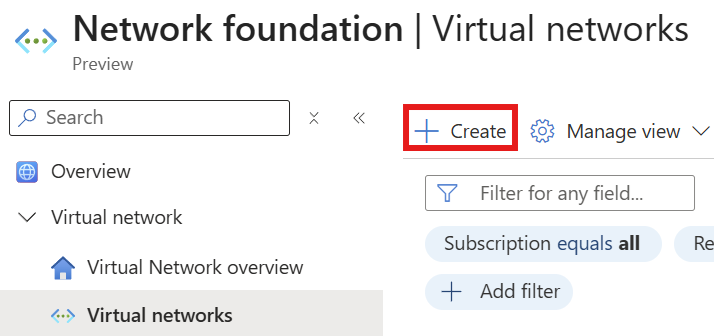

* Select an appropriate subscription.
* Click on the Create new resource group link.
* Enter a name for the new resource group.
* Click on OK.
* Enter a name for the virtual network.
* Select an appropriate region.
* Click on the IP Addresses tab.

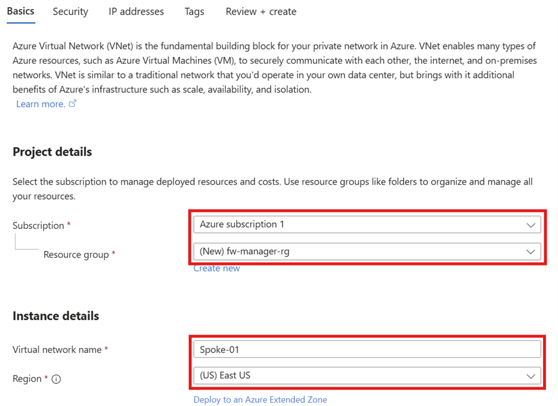

* Click on the default text link under Subnets.
* Enter a name for the subnet.
* Modify the starting IP address.
* Click on Save.

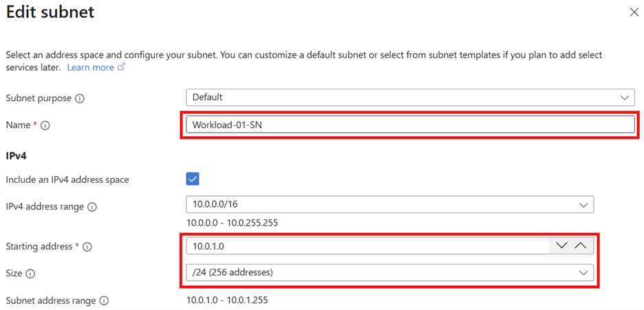

* Click on Review + create.
* Click on Create.

Now we need to create another virtual network.

As above, select an appropriate subscription, select the same resource group, enter an appropriate name for this other virtual network instance, and select the same region as above.

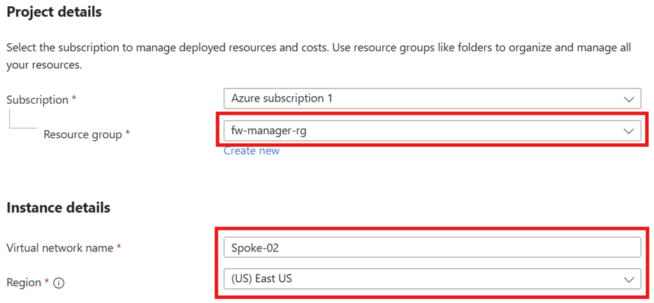

In the IP Addresses tab, update the IP address range.

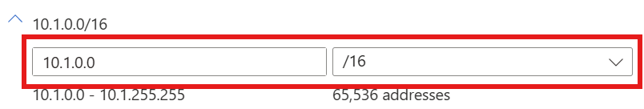

* As above, click on the default text link under Subnets.
* Enter a name for the subnet.
* Modify the starting IP address.
* Click on Save.

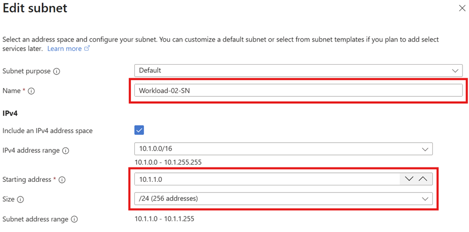

* Click on Review + create.
* Click on Create.

# Creating a Secured Virtual Hub

Next, we need to create a secured virtual hub.
* Go to portal.azure.com.
* Search for Azure Firewalls.
* Under Secure your resources, click on Virtual Hubs.
* Click on Create new secured virtual hub.

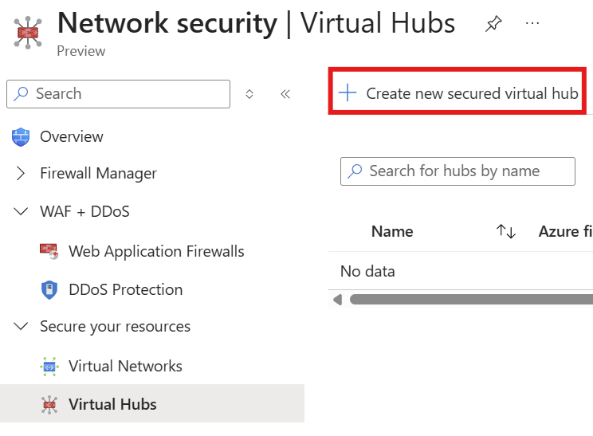

* Select your subscription.
* Select the resource group created earlier.
* Select the same region as used above.
* Enter a name for the virtual hub.
* Enter an appropriate IP address range.
* Select Standard for the type.
* Leave the Include VPN gateway to enable Security Partner Providers unchecked.

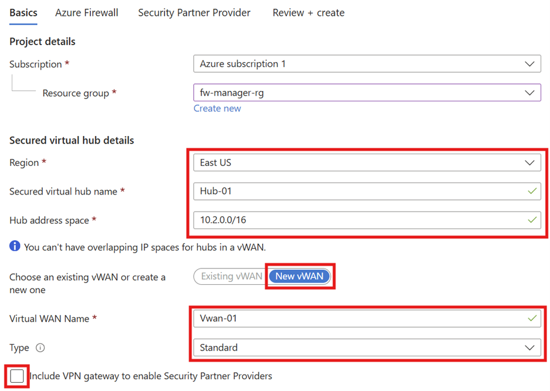

* Click on the Azure Firewall tab.
* Leave the default Azure Firewall setting on Enabled.
* Select the Standard Azure Firewall tier.
* In this case I’ve removed the Availability Zones that were selected.
* Check the box next to the Default Deny Policy.

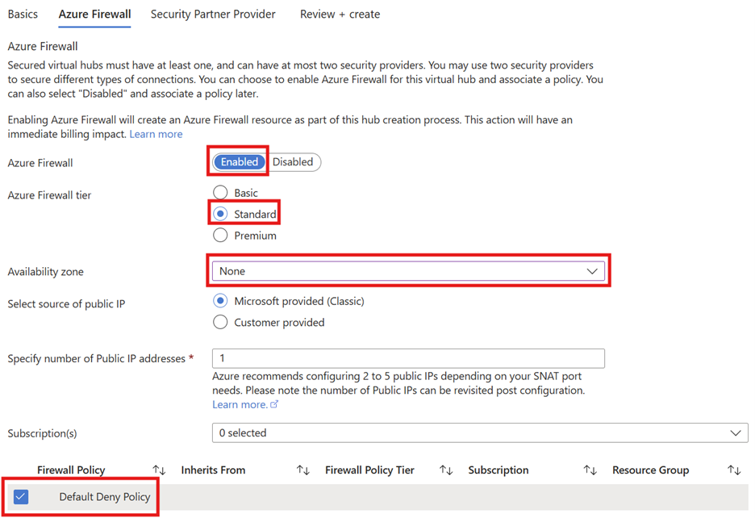

* Click on the Review + create tab.
* Click on Create.

Note: It can take up to 30 minutes to create a secured virtual hub.

* Navigate back to Firewall Manager.
* Click on the Virtual Hubs menu item.
* Select the hub created earlier.

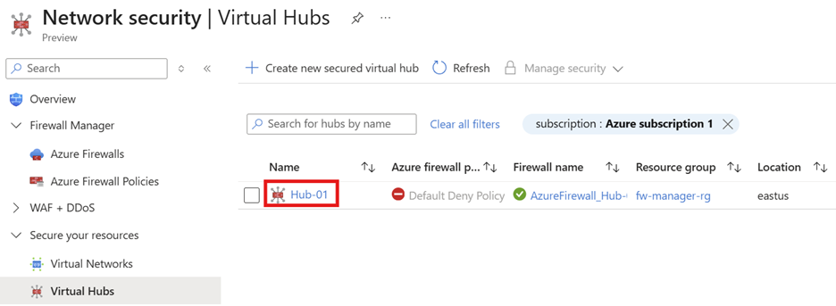

Click on Public IP configuration and make a note of the public IP address listed.

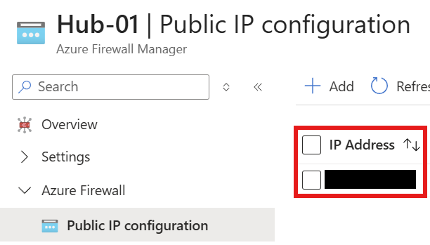

# Creating the Hub and Spoke Virtual Networks

Next, we need to...

* Go to portal.azure.com.
* Navigate to the resource group created earlier.
* Click on the VWAN resource.

* Navigate to Virtual network connections.
* Click on Add connection.

* Enter an appropriate name for the connection.
* Select the hub created earlier.
* Select the resource group created earlier.
* Select the first spoke network created earlier.
* Click on Create.

* Enter an appropriate name for the connection.
* Select the hub created earlier.
* Select the resource group created earlier.
* Select the second spoke network created earlier.
* Click on Create.

# Server Creation

Next, we need to deploy two servers...

* Go to portal.azure.com.
* Navigate to Virtual machines.
* Click on Ceate.
* Click on Virtual machine.

* Select an appropriate subscription.
* Select the resource group created earlier.
* Enter a name for the VM.
* Select the region used above.
* Select an appropriate image for the VM – in this case, Windows Server was used.
* Enter appropriate credentials for the admin account associated with the VM.
* Select None next to Public inbound ports.

* Click on the Networking tab.
* Select the first spoke virtual network.
* Select the first workload subnet.
* Select None for Public IP.

Note: You can optionally click on the Management tab and enable the auto shutdown feature.

* Click on Monitoring.
* Select Disable for the Boot diagnostics feature.

* Click on Review + create.
* Click on Create.

Repeat the above process but select the second spoke virtual network and the second workload subnet instead.

* Go to portal.azure.com.
* Navigate to the above resource group.
* Locate and click on each VM.
* Network settings.
* Note down each VM’s private IP address.

# Creating a Firewall Policy

Next..

* Go to portal.azure.com.
* Navigate to Firewall Manager.
* Nlick on the Azure Firewall Policies menu item.
* Click on Create.

* Select the same resource group as above.
* Enter a name for the policy.
* Select the same region as above.
* Modify the Policy tier to Standard.

* Click on the Rules tab.
* Click on Add a rule collection.

* Enter a name for the rule collection.
* Change the Rule collection type to Application.
* Enter a priority of 100.
* Select Allow under the Rule collection action.
* Enter a name for the rule.
* Select IP Address as the Source type.
* Enter * as the Source.
* Enter http,https under Protocol.
* Select FQDN as the Destination Type.
* Enter *.microsoft.com.
* Click on Add.

Next, we need to add a DNAT rule so that we can connect to our first workload VM via RDP.

* Click on Add a rule collection.
* Enter a name for the rule collection.
* Change Rule collection type to DNAT.
* Enter 100 as the priority.
* Enter a name for the rule.
* Select IP Address as the Source type.
* Enter * as the Source.
* Select TCP as the Protocol.
* Enter 3389 as the Destination Port.
* Enter the public IP address of the firewall created earlier as the Destination.
* Select IP Address as the Translated type.
* Enter the private IP address of the first workload VM.
* Enter 3389 as the Translated port.
* Click on Add.

Next, we need to be able to allow RDP connections from the first workload VM to the second.

* Click on Add a rule collection.
* Enter a name for the rule collection.
* Select Network as the Rule collection type.
* Enter 100 as the priority.
* Select Allow as the Rule collection action.
* Enter a name for the rule.
* Select IP Address as the Source type.
* Enter * as the Source > select TCP as the Protocol.
* Enter 3389 as the Destination Port.
* Select IP Address as the Destination Type.
* Enter the private IP address of the second workload VM.
* Click on Add.

* Click on Review + create.
* Click on Create.

# Policy Association

Next, we need to associate the Firewall Policy to the secured virtual hub.

* Go to portal.azure.com.
* Navigate to Firewall Manager.
* Click on Virtual Hubs.
* Click on the hub that was created earlier.

* Click on the Security provider menu item.
* Click on Add policy.

* Click on the checkbox next to the policy we just created.
* Click on Save.

# Routing Traffic to the Secured Virtual Hub

* Go to portal.azure.com.
* Navigate to Firewall Manager.
* Click on Virtual hubs.
* Click on the hub that was created earlier.

* Click on the Security configuration menu item.
* Change Internet traffic to Azure Firewall.
* Change Private traffic to Send via Azure Firewall.
* Change Inter-hub to Enabled .
* Click on Save.
* Click on OK to the warming message.

# Testing the Firewall

Next, we need to test the...

* On the local machine, hit the Win + R keys.
* Enter mstsc and hit OK.
* Enter the public IP address of the Firewall and leverage the administrator credentials associated with the first workload VM.

* Open Microsoft Edge.
* Attempt to connect to www.microsoft.com.

Attempt to connect to www.google.com.

Next, let’s test RDP connectivity to the second workload VM.

* On the first workload VM, hit Win + R keys.
* Enter mstsc and click on OK.
* nter the private IP of the second workload VM and the username for the administrator account associated with it.
* Click on Connect.

# Resources

* [Microsoft Azure Security Engineer Associate (AZ-500) Professional Certificate](https://www.coursera.org/professional-certificates/microsoft-azure-security-engineer-associate)

