# Azure Firewall Manager

In this scenario, we want to be able to prevent access to web addresses not on the approved list.

# Technologies

* Virtual Networks.
* Virtual Network Peering.
* Virtual Machines.
* Azure Firewall Manager.
* Firewall Policies (DNAT, Application, Network).
* Route Tables.

# Resource group creation

First, we need to create a resource group to house all the resources required. 

* Go to portal.azure.com.
* Navigate to Resource groups.
* Click on Create.

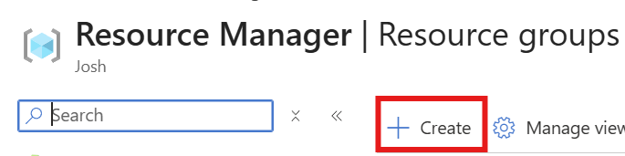

* Select a subscription.
* Enter a name for the resource group
* Select a region.
* Click on Review + create.
* Click on Create.

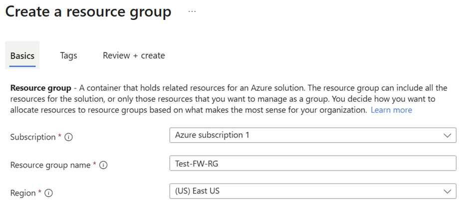

# Virtual network creation

Next, we need to deploy a virtual network. 

* Go to portal.azure.com.
* Navigate to Virtual networks.
* Click on Create.

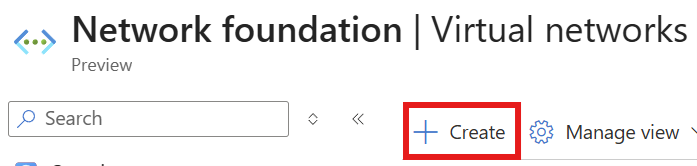

* Select a subscription.
* Select the resource group created earlier.
* Select the same region as above.
* Enter a name for the virtual network.
* Click on the IP Addresses tab.

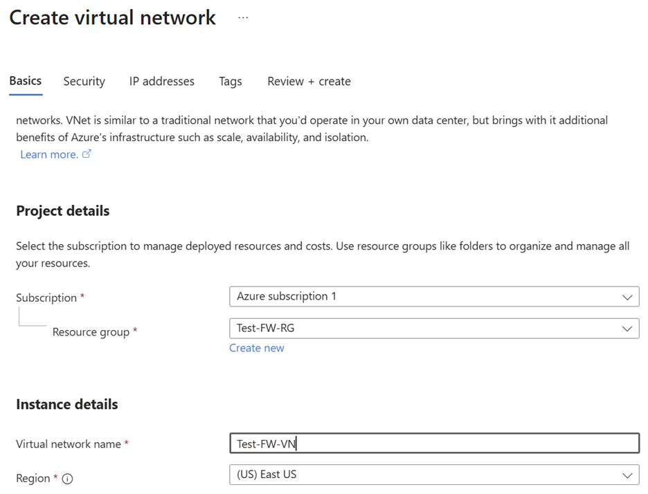

* Click on the initial default subnet name link.
* Change the subnet purpose to Azure firewall - this will be used as the network perimeter/DMZ.
* Update the IP address range as needed.
* Click on Save.

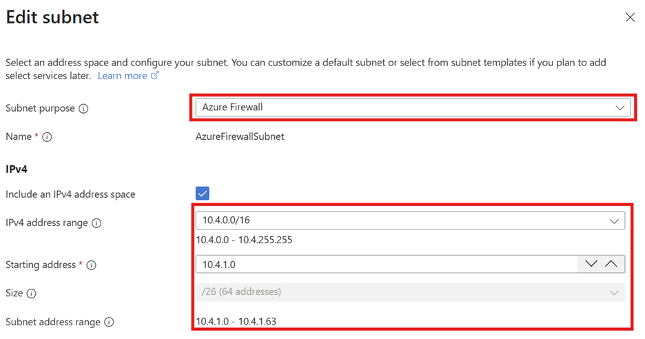

* Click on Add a subnet.
* Enter a name for the subnet - this will be used for the VM we'll be creating.
* Update the IP address range as needed.
* Click on Add.

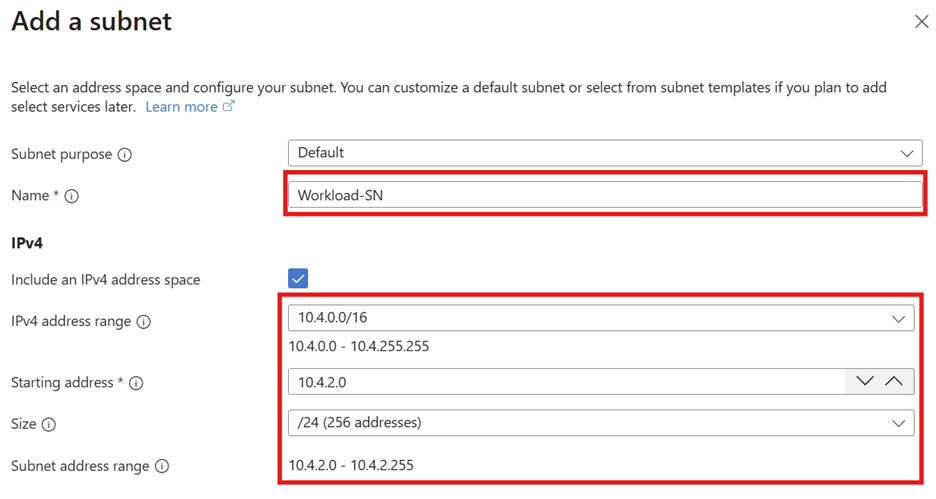

* Click on Review + create.
* Click on Create.

# Creating a VM

We're setting up a VM so that we can test that our Azure Firewalls configuration works as expected.

* Go to portal.azure.com.
* Navigate to Virtual machines.
* Click on Create.
* Click on Virtual machine.

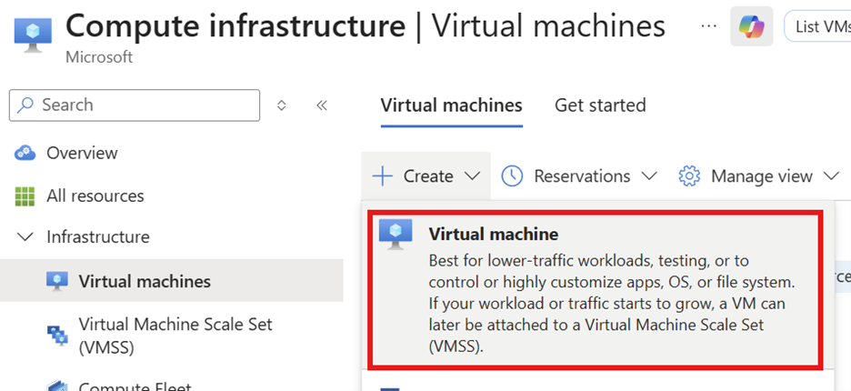

* Under the basics tab, select the resource group from earlier.
* Enter a name for the VM.
* Select the same region as above.
* Select an image to be deployed - something running Windows with initial support for RDP to make our lives easier.
* Define the VM size.

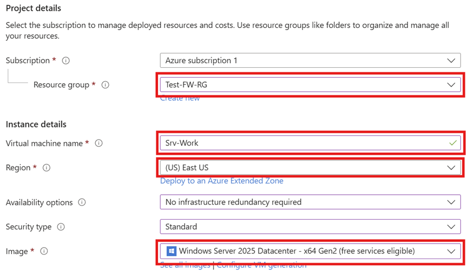

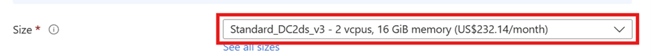

* Choose the username and password for the administrator account attached to the VM.
* Select None for the Public inbound ports option.

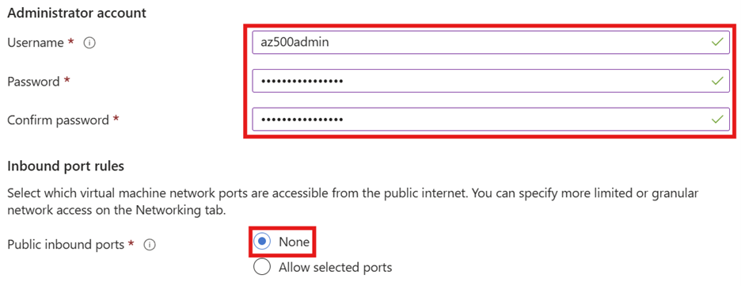

* Click on the Networking tab.
* Select the virtual network that was created earlier.
* Select the appropriate subnet.
* Change the Public IP option to None.

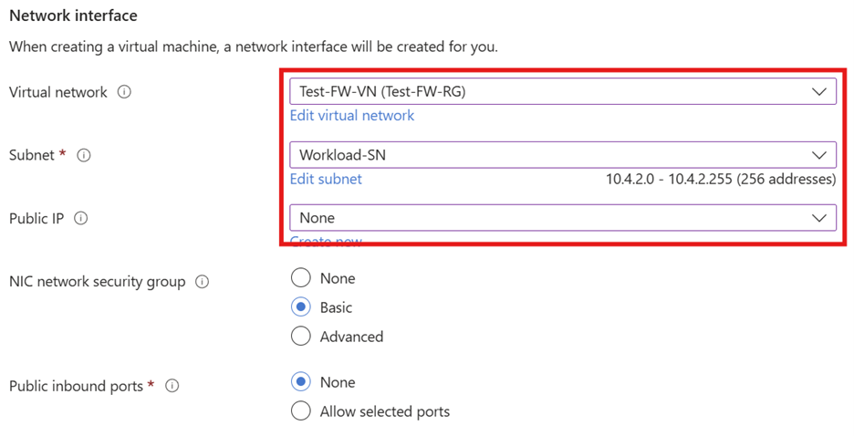

Optionally, you can click to open the Management tab and enable the auto-shutdown feature, which may help to prevent higher costs.

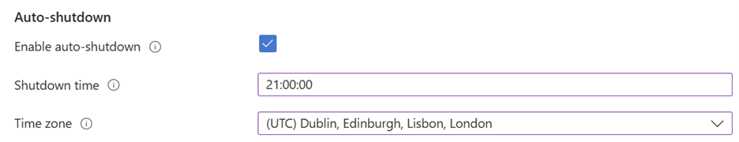

* Click on the Monitoring tab.
* Select the Disable option next to Boot diagnostics.

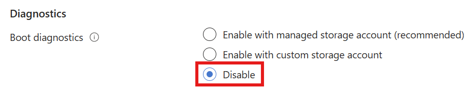

* Click on Review + create.
* Click on Create.

After deployment of the VM has been completed, click on Go to resource and make a note of the Private IP attached to it.

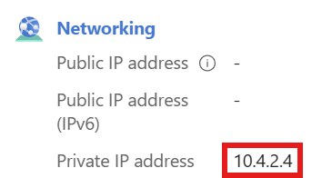

# Creating a Firewall

We need to set up Azure Firewall so that we're able to filter the traffic and only the specified domains are accessible via our VM.

* Go to portal.azure.com.
* Navigate to Firewalls.
* Click on Create.

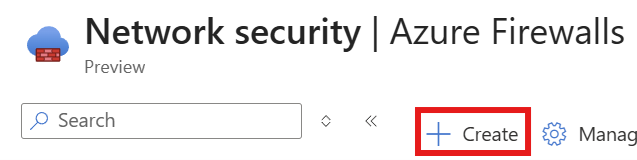

* Select the resource group that was created earlier.
* Enter a name for the firewall.
* Select the same region as above.
* Select the Standard SKU option.

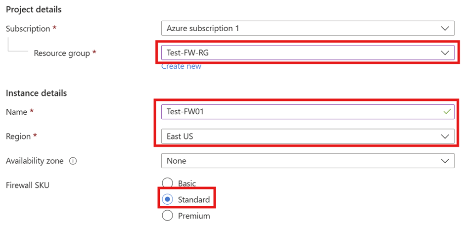

* Select the Use Firewall rules (classic) to manage this firewall option next to Firewall management.
* Select the Use existing option next to Choose a virtual network and select the virtual network that was created earlier.
* Create a new Public IP.
* Uncheck the box next to Enable Firewall Management NIC.

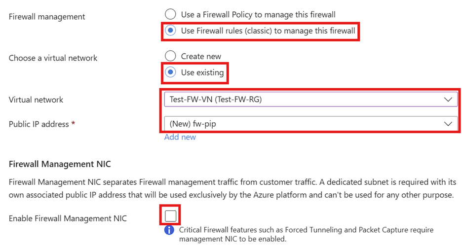

* Click on Review + create.
* Click on Create. 

After the firewall has been deployed, click on Go to resource and make a note of both the private and public IP addresses.

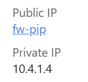

Note: You can click on the link provided to locate the public IP address. 

Next, we need to set up a default route. 

* Go to portal.azure.com.
* Navigate to Route Tables.
* Click on Create.

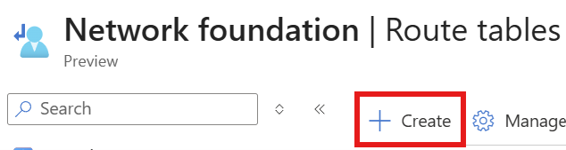

* Select the resource group that was created earlier.
* Enter a name for the route table.
* Select the same region as above.
* Click on Create + review.
* Click on Create.

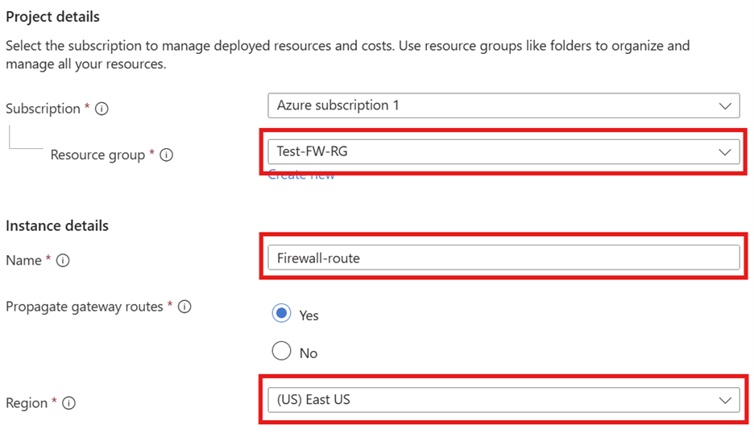

After deployment, click on Go to resource. 

* Navigate to the Subnets tab.
* Click on Associate.

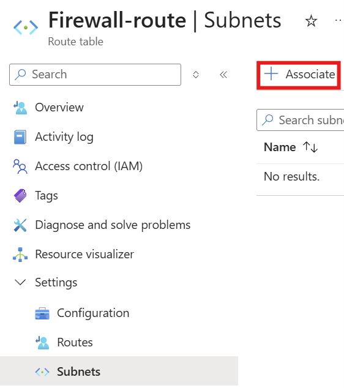

* Select the virtual network that was created earlier.
* Select the subnet that contains the VM.
* Click on OK.

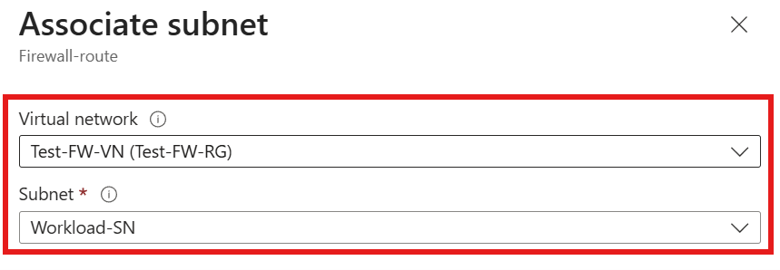

* Navigate to the Routes tab.
* Click on Add.

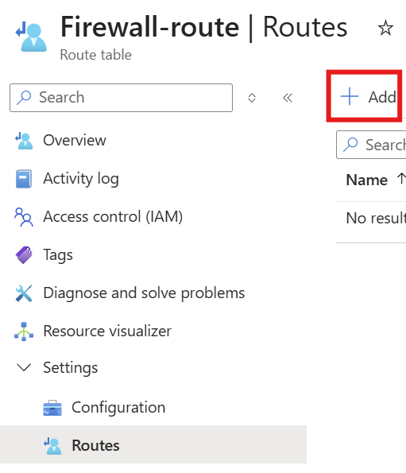

We need to set up a default route so that traffic can be sent straight to the Azure Firewall instance.

* Enter a name for the route.
* Select IP Addresses as the Destination type.
* Enter 0.0.0.0/0 as the CIDR range.
* Select Virtual appliance as the Next hop type.
* Enter the private IP address of the firewall - forces traffic using this route to be sent to the Azure Firewall instance.
* Click on Add.

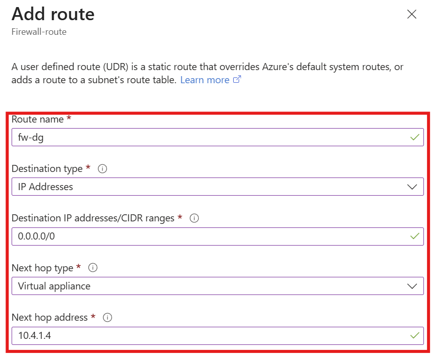

We need to set up a rule that will allow HTTP and HTTPS traffic when trying to access www.google.com.

* Navigate back to the firewall.
* Settings tab.
* Rules (classic).
* Click on the Application rule collection tab.
* Click on Add application rule collection.

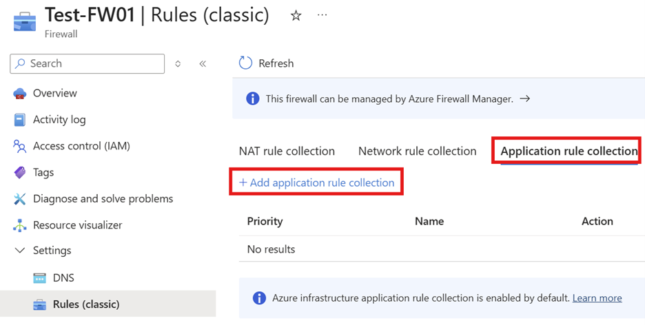

* Enter a name for the rule collection.
* Enter a priority number.
* Select Allow next to Action.
* Entera name for the Target FQDN.
* Select IP address for Source type.
* Enter the network address of the subnet containing the VM for Source.
* Enter http, https for port.
* Enter www.google.com for Target FQDNs.
* Click on Add.

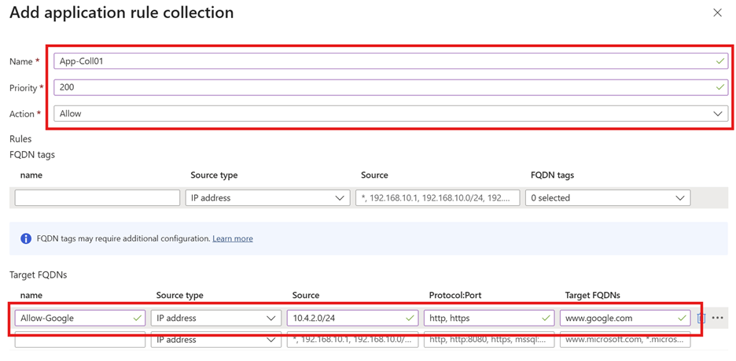

Next, we need to allow access to external DNS servers.

* Navigate back to the firewall.
* Settings tab.
* Rules (classic).
* Click on the Network rule collection tab.
* Click on Add network rule collection.

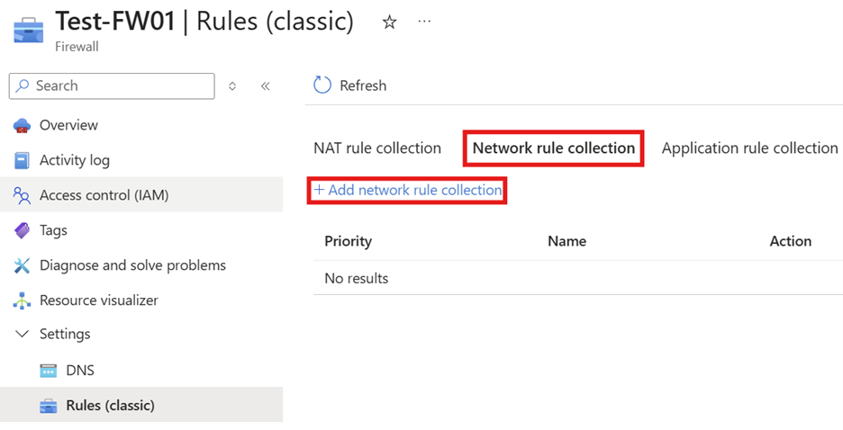

* Enter a name for the rule collection.
* Enter a priority number.
* Select Allow next to Action.
* Enter a name for the IP Address.
* Select UPD for Protocol.
* Select IP address for source.
* Select IP address for Destination type.
* Enter 209.244.0.3,209.244.0.4 for Destination Addresses.
* Enter 53 for Destination port.
* Click on Add.

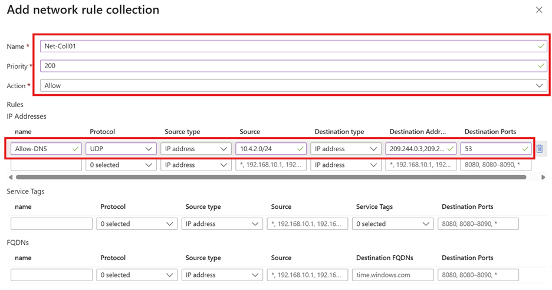

Next, we need to set up a NAT rule to allow remote desktop connectivity to the VM. 

* Navigate back to the firewall.
* Settings tab,
* Rules (classic).
* Click on the NAT rule collection tab.
* Click on Add NAT rule collection.

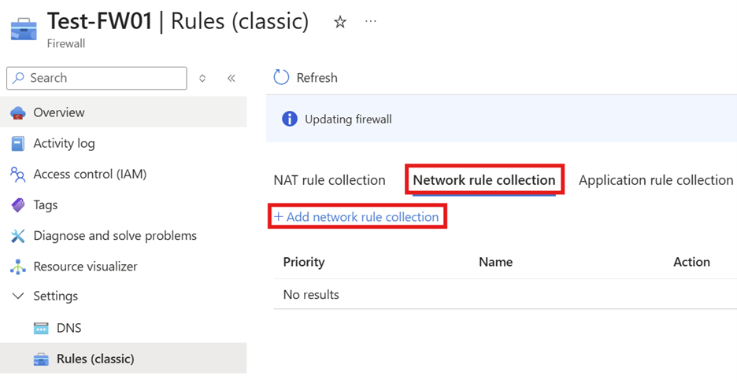

* Enter a name for the rule collection.
* Enter a priority number.
* Enter a name for the rule.
* Select TCP for Protocol.
* Enter * for source.
* Enter the firewall’s public IP address for Destination address.
* Enter 3389 for Destination Port.
* Enter the VM’s private IP address for Translated address.
* Enter 3389 for Translated port.
* Click on Add.

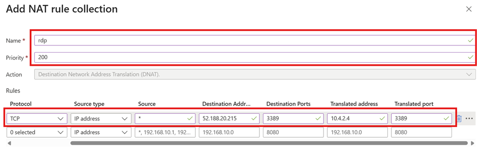

Next, we need to update the primary and secondary DNS addresses for the VM. 

* Navigate to the VM.
* Network Settings.
* Click on the NIC link.

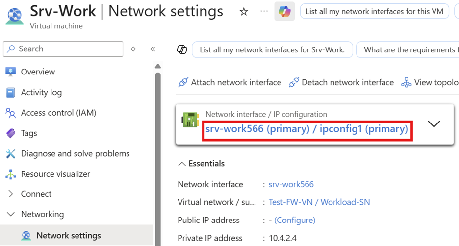

* Navigate to the DNS servers tab.
* Select the Custom radio button under DNS servers.
* Enter 209.244.0.3 and 209.244.0.4.
* Click on Save.

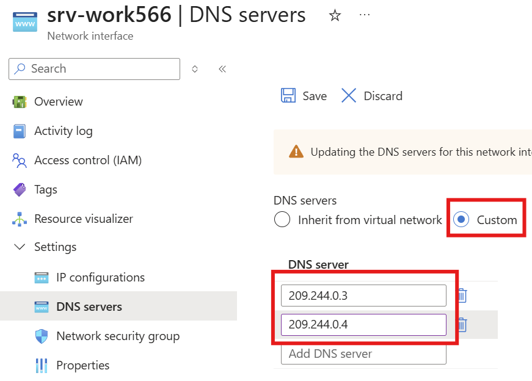

Note: If the VM is still running, restart it.

# Testing

Now we need to test that the firewall works as expected. 

* On your local machine, hit Win Key + R.
* Type in mstsc, then hit enter.
* Enter the public IP address of the firewall.
* Enter the username associated with the VM created earlier.
* Click on Connect.

* Once connected to the VM, open Edge or another browser.
* Try to navigate to www.google.com.
* Try to navigate to another address and note that due to there being no rule match, the action is denied.

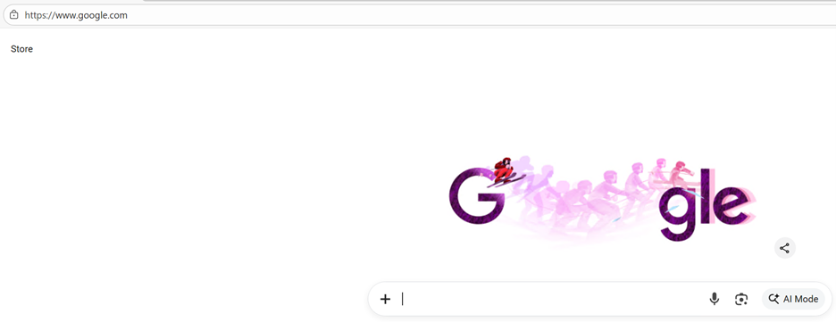

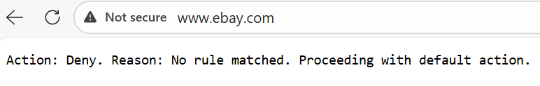

# Resources

* [Microsoft Azure Security Engineer Associate (AZ-500) Professional Certificate](https://www.coursera.org/professional-certificates/microsoft-azure-security-engineer-associate)

