# Network Security Groups

In this scenario, we want to be able to configure an inbound rule attached to a Network Security Group (NSG) to allow web traffic.

# Technologies

* Virtual Networks.
* Virtual Machines.
* Network Security Groups (NSG).

# Setting up a VM

First, we need to create a resource group to house all the resources required. 

* Go to portal.azure.com.
* Navigate to Virtual machines.
* Click on create.
* Click on Virtual machine.

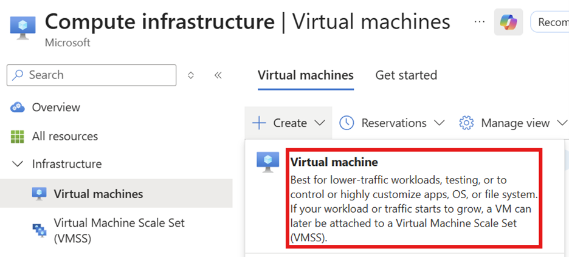

* Select an appropriate subscription.
* Click on Create new under Resource group, enter a name for the new resource group and click on OK.
* Enter a name for the VM.
* Select the region used above.
* Select an appropriate image for the VM – in this case, Windows Server was used.
* Enter appropriate credentials for the admin account associated with the VM.
* Select None next to Public inbound ports.

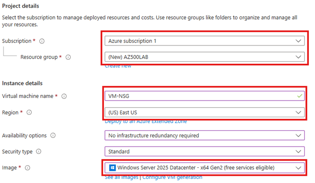

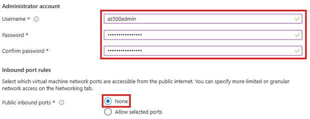

* Click on the Networking tab.
* Leave the default Virtual network and Subnet configuration, select Create new for Public IP and leave the defaults.

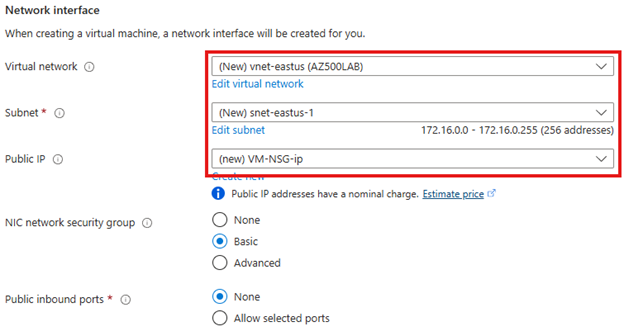

Note: You can optionally click on the Management tab and enable the auto shutdown feature.

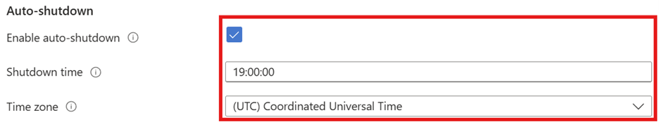

* Click on Monitoring.
* Select Disable for the Boot diagnostics feature.

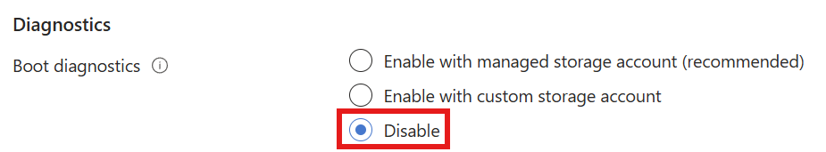

* Click on Review + create.
* Click on Create.

* After the resources have finished being provisioned, click on Go to resource.
* Click on Connect.
* Click on Connect. 

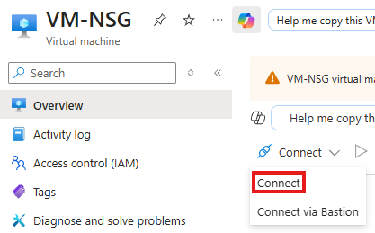

* Click on Check access under Connection prerequisites.

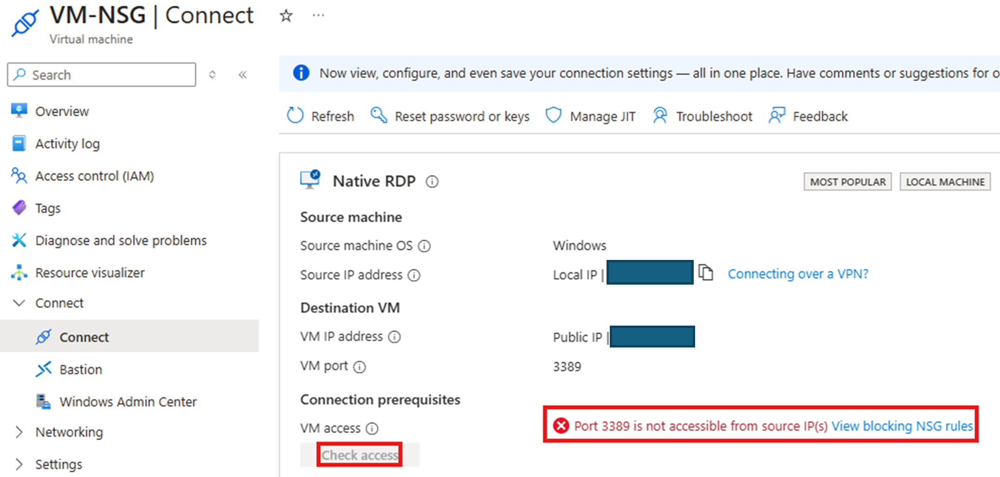

Connectivity via port 3389 (RDP) is currently blocked because we didn’t configure this when setting up the VM. 

* Click on the Network settings menu item.
* Click on Create port rule.
* Click on Inbound port rule. 

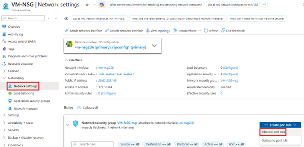

* Select My IP address as the Source.
* Enter * for the Source port range.
* Select Any for Destination.
* Select Custom for Service (although you could select RDP).
* Enter 3389 for the Destination port range.
* Select TCP for the Protocol.
* Select Allow for the Action.
* Enter a priority number.
* Enter a name for the rule.
* Click on Add.

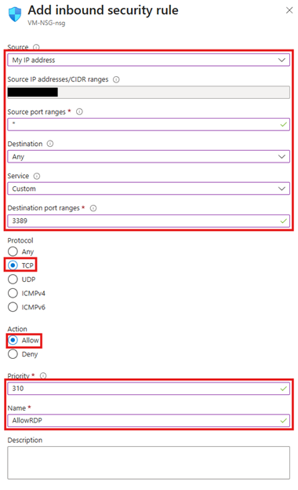

* Go back to the Connect menu item.
* Click on Check access and you should now see that port 3389 is accessible.

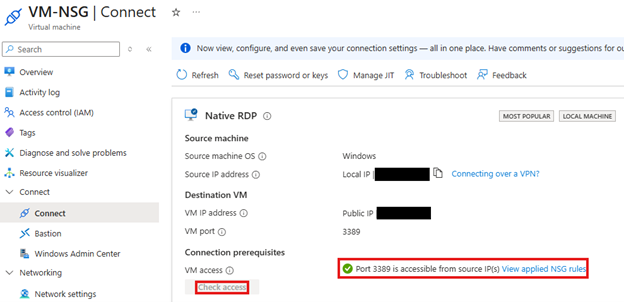

* Click on Download RDP File.
* Open the RDP file.
* Click on Connect.
* Enter the password for the administrator account associated with the VM.
* Click Yes on the warning message box. 

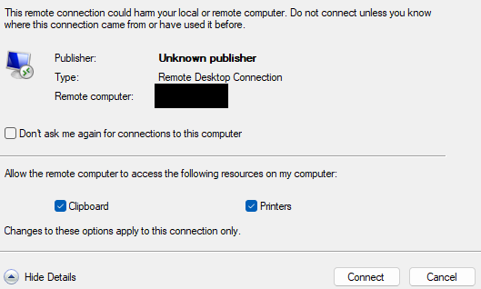

# Installing IIS on the VM

Next, we need to set up the IIS role on the newly created VM.

* Open Server Manager.
* Click on Dashboard.
* Click on Add roles and features.

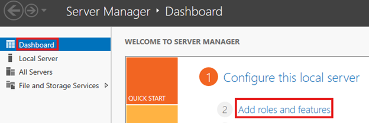

* Click Next on the Before you begin screen.
* Select the Role-based or feature-based installation radio button.
* Click on Next.

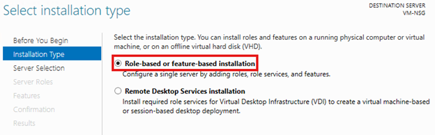

* Click the Select a server from the server pool radio button.
* Click on Next.

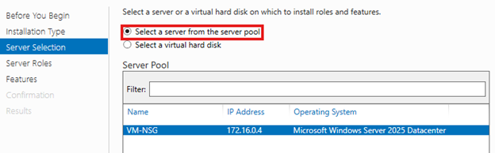

* Select the Web Server (IIS) checkbox on the Server Roles screen.

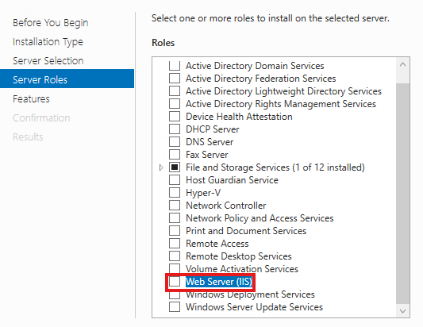

* In the Add Roles and Features Wizard popup box, click on the Include management tools checkbox.
* Click on Add Features.

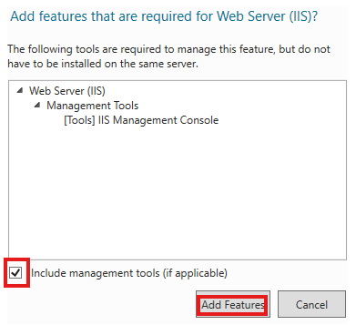

* Click Next on both the Server Roles, Features, Web Server Role (IIS) and Role Services screens.
* Click on Install on the Confirmation screen.

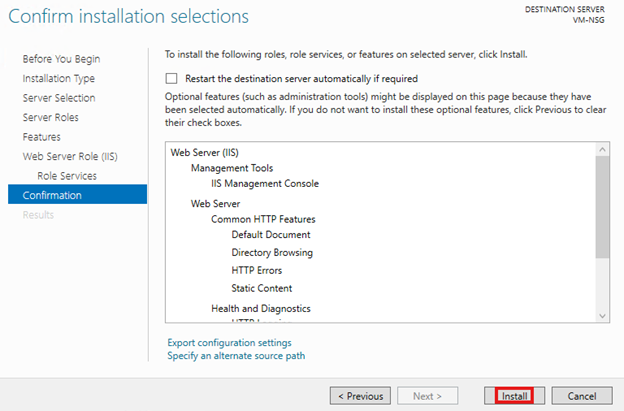

* Once you see the 'Installation succeeded on...' message, click on Close.

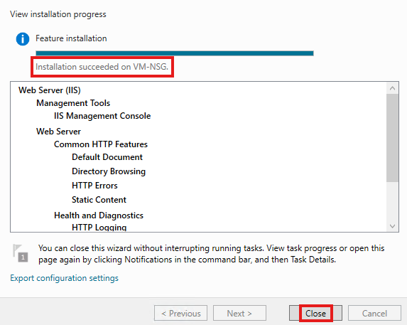

* Reopen the Add roles and features menu.
* Repeat the above steps up to the Server Roles screen./
* Select the IIS 6 Management Compatibility checkbox.
* Click Next through the screens and eventually click on Install on the Confirmation screen.

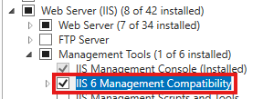

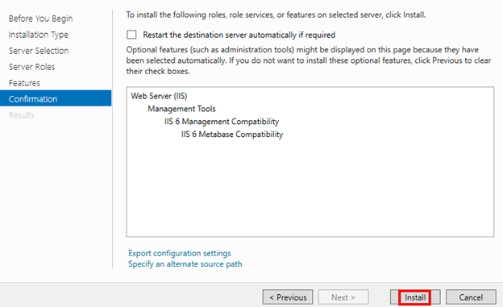

As before, click on Close after installation has finished. 

Open up a web browser on the VM and navigate to http://localhost/.

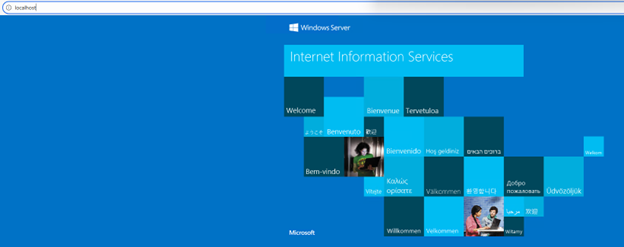

Repeat the above process but try navigating to http://<public-ip-for-vm>.

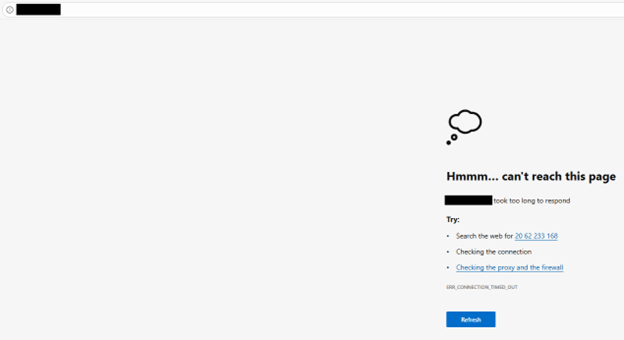

# Adding an Inbound NSG Rule for Web (Port 80) Traffic

Next, we need to configure an inbound NSG rule, allwoing us to connect to the web server via port 80.

* Go to portal.azure.com.
* Navigate back to the VM.
* Make a note of the VM’s private IP address under Network settings. 

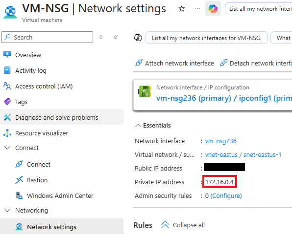

* Click on Create port rule.
* Click on Inbound port rule.
* Select service tag as the Source.
* Select Internet the Source service tag.
* Enter * for the Source port range.
* Select IP Addresses as the Destination.
* Enter the private IP address of the VM.
* Select Custom for Service.
* Enter 80 for Destination port range.
* Select TCP for Protocol.
* Select Allow for the Action.
* Enter a priority number.
* Enter a name for the rule.
* Click on Add.

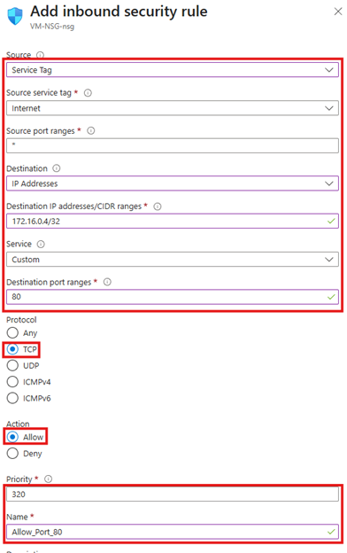

Now, if we repeat the process of trying to navigate to http://<public-ip-for-vm>, it will work due to the new rule that was created. 

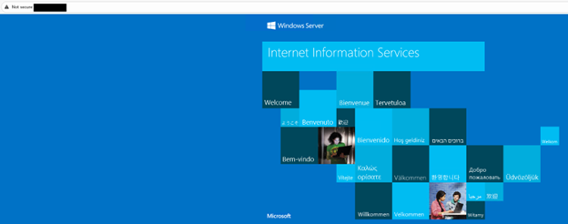

# Resources

* [Microsoft Azure Security Engineer Associate (AZ-500) Professional Certificate](https://www.coursera.org/professional-certificates/microsoft-azure-security-engineer-associate)

