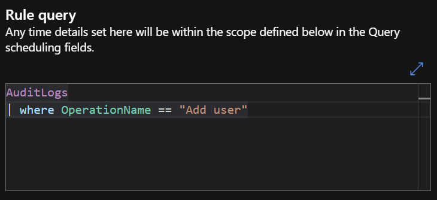
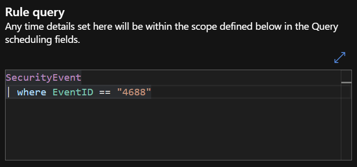
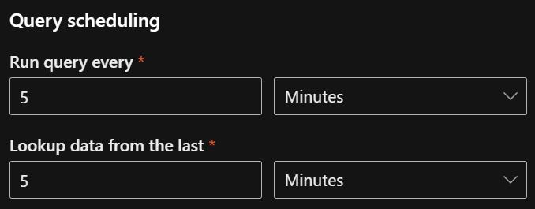

[HOME](./index.md)

# Analytic Rules

## Scheduled

These run within a defined timeframe. 

To configure this rule type head to security.microsoft.com > Sentinel > Configuration > Analytics and click on Create > Scheduled Query Rule. 

Enter a name for the rule, leave the remaining settings as they are and click Next. 

Enter your KQL query here. In this case we’re looking in the AuditLogs table under the OperationName column for a match against “Add user”.

Leave the remaining settings as they are and click Next and do the same for the rest of the tabs as we don’t need to change anything else right now.

## Scheduled Security Events

To configure this rule type head to security.microsoft.com > Sentinel > Configuration > Analytics and click on Create > Scheduled Query Rule.  

Enter a name for the rule, change the MITRE dropdown to Persistence > Create or modify system process, but leave the remaining settings as they are and click Next. 

Enter your KQL query here. In this case we’re looking in the SecurityEvent table under the EventID column for a match against “4688”.

Change both the Run query every and Lookup data from the last settings to 5 minutes.

Leave the remaining settings as they are and click Next. 

Under Incident Settings enable Alert grouping, leave the remaining settings and clcik Next. 

Click Next through the rest of the tabs.

## Near-Real-Time (NRT)

To configure this rule type head to security.microsoft.com > Sentinel > Configuration > Analytics and click on Create > NRT Query Rule.    

Enter a name for the rule, leave the remaining settings as they are and click Next.  

Enter your KQL query here. In this case we’re looking in the SecurityEvent table under the EventID column for a match against “4688”.

Leave the remaining settings as they are and click Next and do the same for the rest of the tabs as we don’t need to change anything else right now.

# Resources

* [Christopher Nett's SC-200 Course](https://www.udemy.com/course/sc-200-microsoft-security-operations-analyst-r/)
