# Automated Blob Storage Malware Removal

First, we need to create a storage account.

* Head to portal.azure.com and search for the Storage accounts service, then click on Create. 
* Enter a name for your storage account, adjust the remaining settings as desired and click Next.

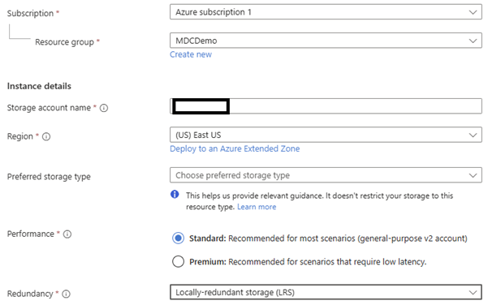

* Click Next on the Advanced tab. 
* Select the Disable option under Public network access section, then click next.

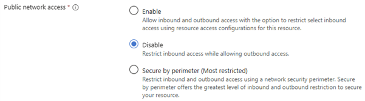

* For the remaining tabs, leave the settings as they are by default. 
* After the resource has been created, head over to its main page > Containers, then click on Add container. 
* Enter a name for the container and click on Create.

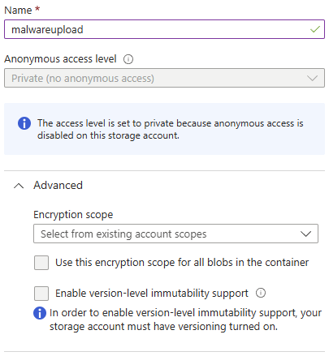

Next, we need to set up a Kali Linux VM. In this case, we’ll use VirtualBox. 

* Head to virtualbox.org, head to downloads and click the link that’s relevant to your host OS and proceed to run the installer - the default installation settings should be adequate. 
* Head to kali.org, click on download then on Virtual Machines, and finally click on the VirtualBox button > extract the downloaded zip file. 
* After opening Virtual Box, click on Open, then select the .vbox file.

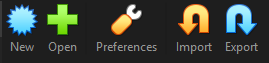

It’s recommended that you tweak the settings of your VM instance by clicking on Settings with your Kali Linux VM selected, then going to System and updating the Base Memory and Number of CPUs.

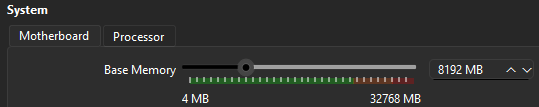

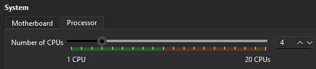

We need to make sure that the Kali Linux VM can connect to the storage account that we created. 

* Head to the storage account within Azure and click on Networking via a web browser on the Kali Linux VM. 
* Enable Public network access by clicking on the Disabled text link, select Enable, then under IPv4 Addresses click Add your client IPv4 address, and finally click Save.

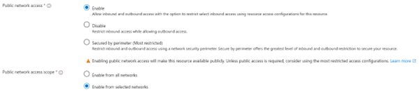

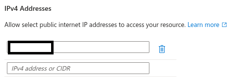

This should allow you to upload files to the storage account. 

* Head to the container we created earlier under the Data storage > Containers menu. 
* Open a new tab and go to exploit-db.com and search for the log4j exploit in the search bar. 
* Click into the Apache Log4j 2 Remote Code Execution (RCE) link, then click on the download button.

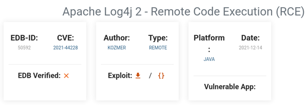

Back on the Azure tab, click on Upload, then drag and drop the downloaded exploit file.

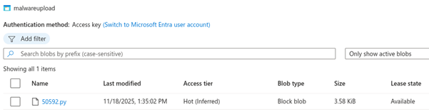

If we then head to Defender for Cloud and check under Security alerts, we should be able to see that an alert was generated based around the malicious file that way uploaded to the storage account.

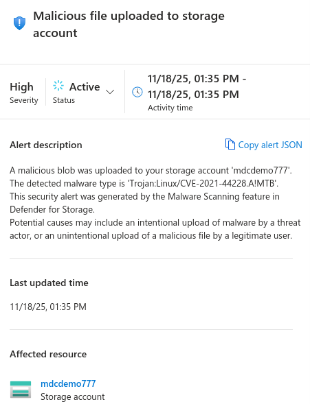

Being able to detect when a malicious file is uploaded is useful, but we may want to be able to automatically remove it. This can be achieved via a Logic App. 

On the Kali Linux VM, open this link [here](https://learn.microsoft.com/en-us/azure/defender-for-cloud/defender-for-storage-configure-malware-scan#option-1-logic-app-based-on-microsoft-defender-for-cloud-security-alerts), which contains a GitHub link to deploy a Logic App via an ARM template. Follow the DeleteBlobLogicApp link on the page and on the GitHub page, click on the Deploy to Azure button.

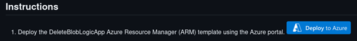

Select your subscription and resource group, then click on Review + create, then Create.

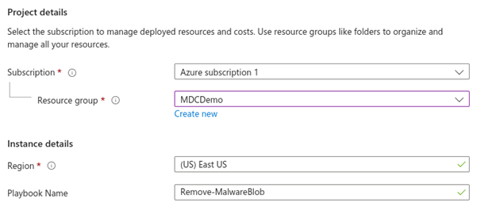

We now need to give the logic app the relevant permissions to access blog storage. 

* Head over to Logic apps and select your newly created logic app resource from the list. 
* Go to Identity under Settings, then click on Azure role assignments.

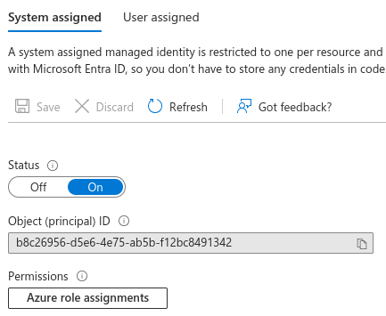

Click on Add role assignment, define your scope, which will be subscription, select your subscription, then select the Storage Blob Data Contributor role. Click on Save.

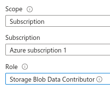

Next, go to Workflow automation under Management in Defender for Cloud and click on Add workflow automation.

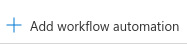

Enter a name for your workflow automation, select the same resource group as before, make sure that Security alert is selected under Defender for Cloud data type, and enter ‘Malicious file uploaded to storage account’ under Alert name. 

Select the previously added logic app under Logic App name, then click on Create.

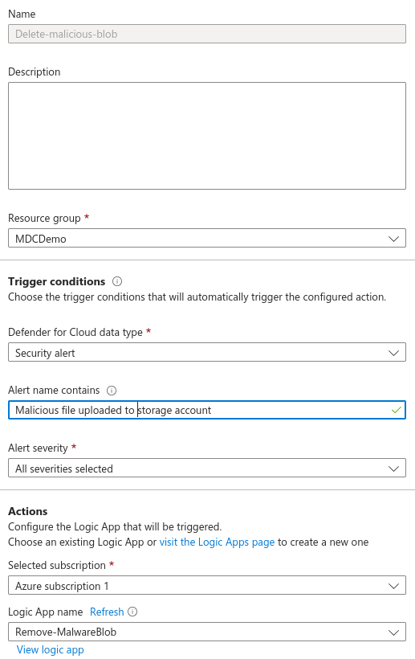

Finally, we can test that the automation works by going back to our storage account and reuploading the malicious file that was downloaded onto our Kali Linux machine before.

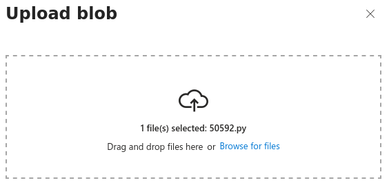

Just after uploading the malicious file, the workflow was triggered, and the file was removed – can be seen on the Overview page of your logic app.

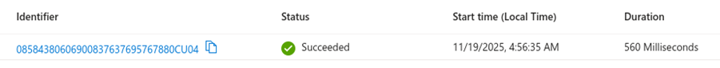

You can also see the actual logic of the app by clicking on Logic app designer under Development Tools.

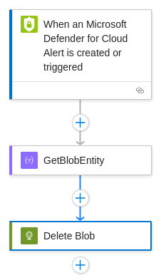

# Resources

* [Christopher Nett's SC-200 Course](https://www.udemy.com/course/sc-200-microsoft-security-operations-analyst-r/)
